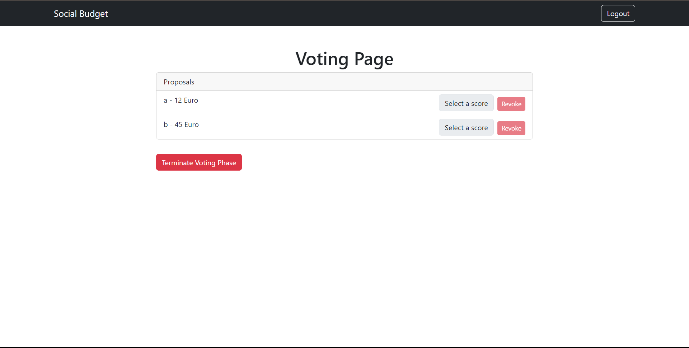

# Exam #2: "Social Budget"

## Student: s327728 Torabiardekani Amirhossein

## React Client Application Routes

- Route `/login`: Login page for users and admin to authenticate.
- Route `/admin`: Admin panel to set budget and manage proposals.
- Route `/user`: User panel to submit and view proposals.
- Route `/voting`: Page for voting on proposals during Phase 2.
- Route `/phase3`: Page to display approved and non-approved proposals after voting in Phase3.
- Route `/guest`: Guest view to see approved proposals during Phase 3.

## Main React Components

- `Login` (in `Login.jsx`): Component for user and admin authentication.
- `Admin` (in `Adminpanel.jsx`): Component for admin to set budget and manage proposals.
- `User` (in `Userpanel.jsx`): Component for users to submit and view their proposals.
- `ProposalSubmission` (in `ProposalSubmission.jsx`): Component for submitting, editing, and deleting proposals.
- `Votingpage` (in `Votingpage.jsx`): Component for voting on proposals..
- `Phase3Results` (in `Phase3Results.jsx`): Component to display results of approved and non-approved proposals.
- `GusetView` (in `GusetView.jsx`): Component for guests to view approved proposals during Phase 3.
- `Layout` (in `Layout.jsx`): Layout component to handle navigation and logout functionality.

(only _main_ components, minor ones may be skipped)

## API Server

- **POST `/api/auth/login`**: Authenticate user or admin.

  - **Request body**: `{ "username": "string", "password": "string" }`
  - **Response body**: `{ "token": "string" }`
  - **Status codes**: `200 OK`, `401 Unauthorized`

- **GET `/api/phase`**: Get current phase of the application.

  - **Response body**: `{ "currentPhase": "number" }`
  - **Status codes**: `200 OK`, `500 Internal Server Error`

- **POST `/api/budget`**: Set the budget for proposals.

  - **Request body**: `{ "amount": "number" }`
  - **Response body**: `{ "amount": "number" }`
  - **Status codes**: `200 OK`, `400 Bad Request`, `500 Internal Server Error`

- **GET `/api/budget`**: Get the current budget.

  - **Response body**: `{ "amount": "number" }`
  - **Status codes**: `200 OK`, `500 Internal Server Error`

- **GET `/api/proposals`**: Get all proposals.

  - **Response body**: `[{ "id": "number", "userId": "number", "description": "string", "cost": "number", "totalScore": "number" }]`
  - **Status codes**: `200 OK`, `500 Internal Server Error`

- **GET `/api/proposals/user`**: Get proposals for the logged-in user.

  - **Response body**: `[{ "id": "number", "description": "string", "cost": "number" }]`
  - **Status codes**: `200 OK`, `500 Internal Server Error`

- **POST `/api/proposals`**: Add a new proposal.

  - **Request body**: `{ "description": "string", "cost": "number" }`
  - **Response body**: `{ "id": "number", "userId": "number", "description": "string", "cost": "number" }`
  - **Status codes**: `201 Created`, `400 Bad Request`, `500 Internal Server Error`

- **PUT `/api/proposals/:id`**: Update a proposal.

  - **Request body**: `{ "description": "string", "cost": "number" }`
  - **Response body**: `{ "id": "number", "userId": "number", "description": "string", "cost": "number" }`
  - **Status codes**: `200 OK`, `400 Bad Request`, `500 Internal Server Error`

- **DELETE `/api/proposals/:id`**: Delete a proposal.

  - **Response body**: `{ "message": "string" }`
  - **Status codes**: `200 OK`, `500 Internal Server Error`

- **GET `/api/proposals/approved`**: Get approved proposals for Phase 3.

  - **Response body**: `{ "approvedProposals": [{ "id": "number", "userId": "number", "description": "string", "cost": "number", "totalScore": "number" }], "nonApprovedProposals": [{ "id": "number", "description": "string", "cost": "number", "totalScore": "number" }] }`
  - **Status codes**: `200 OK`, `500 Internal Server Error`

- **POST `/api/proposals/reset`**: Reset the system to Phase 0.

  - **Response body**: `{ "message": "string" }`
  - **Status codes**: `200 OK`, `500 Internal Server Error`

- **POST `/api/preferences`**: Upsert a preference.

  - **Request body**: `{ "proposalId": "number", "score": "number" }`
  - **Response body**: `{ "success": "boolean" }`
  - **Status codes**: `200 OK`, `500 Internal Server Error`

- **GET `/api/preferences`**: Get preferences for the logged-in user.

  - **Response body**: `[{ "id": "number", "userId": "number", "proposalId": "number", "score": "number" }]`
  - **Status codes**: `200 OK`, `500 Internal Server Error`

- **DELETE `/api/preferences`**: Delete a preference.
  - **Request body**: `{ "proposalId": "number" }`
  - **Response body**: `{ "success": "boolean" }`
  - **Status codes**: `200 OK`, `500 Internal Server Error`

## Database Tables

- Table users: Stores user data including id, username, password, and role (admin/user).
- Table budgets: Stores the budget information including id and amount.
- Table phases: Stores the current phase of the application including id and currentPhase.
- Table proposals: Stores proposal information including id, userId, description, cost, and totalScore.
- Table preferences: Stores voting preferences including id, userId, proposalId, and score.

## Screenshots

## Users Credentials

- Admin: admin, adminpass
- User1: user1, user1pass
- User2: user2, user2pass
- User3: user3, user3pass
